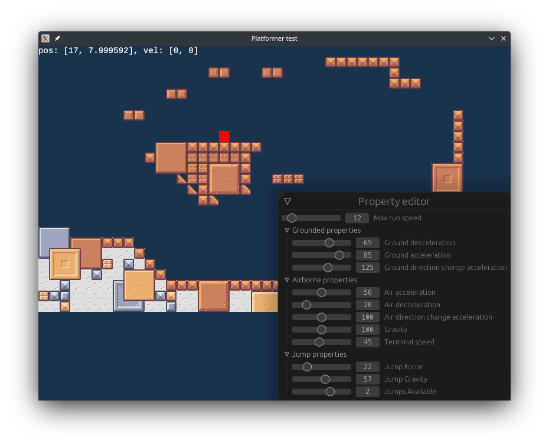

# Platformer test

A platformer template made in Rust, using `ggez` as framework and `tiled` for loading levels.

May evolve into an engine at some point; This repo is going to serve as the base for one of my future projects.

## Controls
A, D: Move left/right respectively
Space: Jump (Hold to jump higher)

You can press Ctrl+I to bring up the player properties window.

If the "jumps available" setting is over 1, you can press the jump button in midair to jump again.

If the "wall sliding" setting is enabled, you can slide down walls simply by touching them once. You
can stop sliding by moving on the opposite direction.

If the "wall jumping" setting is enabled, press the jump button while sliding down a wall to perform
a walljump.

## Current / TODO Mechanics
### Level
- [x] Load a single level
- [x] Display multiple tile layers
- [x] Load multiple levels (rooms) from a Tiled world
- [x] Navigation around multiple rooms
- [ ] Camera movement within a single room
- [ ] Minimap / Display map within pause menu

### Controls
- [x] Basic player movement
- [ ] Control rebinding
- [ ] Gamepad support

### Mechanics
- [x] Simple AABB collision
- [x] Multijump
- [x] Sliding down walls
- [x] Walljump
- [ ] Sticking to walls
- [ ] Gravity switching

### Graphics
- [ ] Sprite atlas support
- [ ] Tile animation
- [ ] Player animation (Walking, jumping, etc)
- [ ] Support for externally defined (non-hardcoded) animation data

### Enemies
- [ ] Basic enemy AI (Walking left-right until collision)
- [ ] Player/enemy health & damage system
- [ ] Basic proyectile weapons

### Extra
- [x] Simple pause menu
- [ ] Scripting support
- [ ] Cutscene utils
